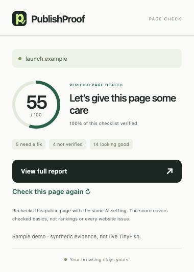

# PublishProof

You built a website. Now understand what needs attention.

PublishProof turns a public page into a small, plain-English checklist: what works, what needs a fix, and what we could not verify. Open the Chrome extension, click **Audit this page**, see your verified page-health score, then choose **View full report**. Copy a repair prompt for your coding agent and check the same page again after deploying your reviewed changes.

**Version 0.2 is a working local prototype.** PublishProof is a provisional name. The report opens locally; a hosted customer service is not deployed.



## The experience

- A compact popup with one main action, a score, coverage, and a link to the full report. Public-page permission is explicit; AI search is an optional separate opt-in.
- A calm report with **Needs a fix**, **Worth a review**, **Not verified**, and **Looking good**. Findings explain the effect in everyday language and identify the exact page.
- **Copy repair prompt** for a coding agent. Detailed evidence, acceptance tests, score methodology, and Markdown/JSON exports are available under optional details and the **Technical details** tab.
- A fresh **Check again** after a repair. The same checklist and URLs are compared; a score changes only when the measured evidence changes. Missing evidence stays unknown.
- Small transitions, keyboard navigation, a mobile layout, and reduced-motion support. Audits continue in a report tab when the popup closes; saved results can be reopened.


Both screenshots use local fixtures, not live TinyFish or evidence of a real website repair. The seeded one-page example moves from **55 to 90** after its simulated repairs; incomplete coverage is still shown.

## Try it without an API key

Requires Node.js 22+ and npm:

```sh
npm ci
npm run verify
npm run demo
```

Open **http://127.0.0.1:4317** for the report or **http://127.0.0.1:4317/popup.html** for the fixture popup preview. Check the public-page permission box and click **Audit this page**. The demo maps the inert `launch.example` origin to its own local HTTP fixtures. Search/Fetch responses are synthetic and labeled. No external API request occurs.

**Check again** simulates revised fixture responses; it does not change a real website. To repeat the original demonstration, stop/restart the demo and forget its saved report. Additional same-origin pages and a target query are available under **More pages & search options** in the report.

## Use it on your public page

Stop the demo and run `npm run dev`. This starts the public HTTP helper without activating TinyFish. Keep it running.

In a separate signed-out Chrome test profile, load **dist/extension** through **Load unpacked**, or first extract [the unpacked ZIP](dist/publishproof-unpacked.zip). If it is already installed, reload it to pick up version 0.2. Open a public website, click PublishProof in the toolbar, confirm permission, and choose **Audit this page**. [Installation and button-testing guide](docs/START-HERE.md).

For the separately approved live TinyFish test on macOS, `npm run test:live` shows a masked key-and-scope dialog. The key remains only in backend memory for 30 minutes. This helper permits one audit and one recheck of each of the three owner-selected homepages, one homepage at a time with the query blank. No browser opens or audit begins automatically. API keys never belong in the extension, repository, report, or recording.

## What the score means

The number is **verified page health**, based on ten fixed checks for page access, search metadata, sampled links, image alternatives, existing page data, and a mobile sizing hint. The report always shows how much of that checklist was verified. Unknown checks earn no verified points; they are not invented failures. Optional analytics, robots.txt, sitemap, llms.txt, or schema are not requirements.

This is a check of selected page basics, not a complete usability/design audit or a Google ranking score. A passing HTTP response does not prove the screen looks right. Repairs improve the number only when they resolve a scored check in a fresh comparable observation. [Full scoring method and limitations](docs/SCORE.md).

## Evidence and TinyFish

Raw HTTP and parsed HTML establish status/redirects, indexing restrictions, robots rules, conflicting canonicals, sampled titles/descriptions, broken internal links/existing OG assets, malformed existing JSON-LD, missing alt attributes, and direct deep-link responses. With permission, current-tab metadata is compared locally with raw HTML; it is not uploaded.

**TinyFish Search** provides a query/locale-specific discovery sample. **TinyFish Fetch** provides fresh cleaned text and bounded excerpts. Those observations complement the raw evidence; cleaned extraction cannot establish the exact raw title, canonical, or JSON-LD. Missing search results do not prove non-indexing, and lexical query matching does not establish semantic understanding or predict rankings. [API contracts and limits](docs/TINYFISH.md).

“Citations” means content references, business directory mentions, or links in particular AI answers. There is no mandatory citation tag. Actual indexing, traffic, analytics event receipt, all AI tools' understanding, and complete accessibility/performance remain outside this prototype's evidence.

## Verified status

Strict typecheck, **55 tests**, and the unpacked build pass. Tests use deterministic fixtures and temporary local servers, with no TinyFish calls. The redesigned report and fixture popup preview passed copy/export, persistence, recheck, keyboard, reduced-motion, and mobile-layout checks.

The **current installed Chrome toolbar flow with live results still needs a manual check**. An isolated native toolbar debugging session closed during testing; its cause was not established and the test was stopped. Fixture popup QA does not prove Chrome's native action behavior. Earlier version 0.1 permissions/raw flow and synthetic retrieval UI checks are historical evidence, not a substitute for that check. [Exact tests and limitations](docs/TEST-REPORT.md).

Bounded live Search/Fetch backend observations were recorded earlier on three owner-selected public homepages. Partial Search samples remain unknown. The redesign made no new TinyFish calls, consumed no additional approved allowance, and did not edit or deploy any real site. [Timestamped live evidence](output/selected-sites/README.md).

## Privacy and scope

Click-triggered `activeTab`/`scripting` and one loopback helper host; no history, cookies, broad site permissions, or authenticated DOM upload. Production HTTP validates public DNS/IPs, pins addresses, checks redirects, and limits requests, time, and response sizes. Prompts treat website content as untrusted evidence and forbid unrelated changes. No automatic edits, deployments, purchases, or form submissions. [Security boundaries](docs/SECURITY.md).

Keys stay server-side. Live helpers require short-lived exact scope approval, with no retry, paid fallback, or automatic renewal. Current pricing/account access must be verified before use; recorded Search/Fetch runs used the documented free endpoints. The optional paid Agent adapter is inactive and has no execution route.

## Bounty and source

Built for the supplied TinyFish SEO Page Auditor brief, with meaningful Search and Fetch contributions. The owner confirmed eligibility/deadline and is preparing the video and required social posts. No award, ranking improvement, or submission is claimed. Private/authenticated/token-bearing URLs are excluded even though the brief says “any URL.” [Requirement map](docs/BOUNTY.md) · [Demo plan](docs/DEMO.md).

The emphasis is evidence reliability and beginner clarity. Agent prompts and rechecks already exist in other products; no novelty claim is made.

`src/extension` contains the MV3 popup/report, `src/shared` contains rules/scoring/prompts, and `src/server` contains the bounded scanner and adapters. `tests` and `scripts` hold fixtures and explicit launchers. Generated unpacked files are in `dist`. At most ten chosen-page reports persist in local browser storage; **Forget this saved report** removes the selected record. Explicit exports remain on disk.
